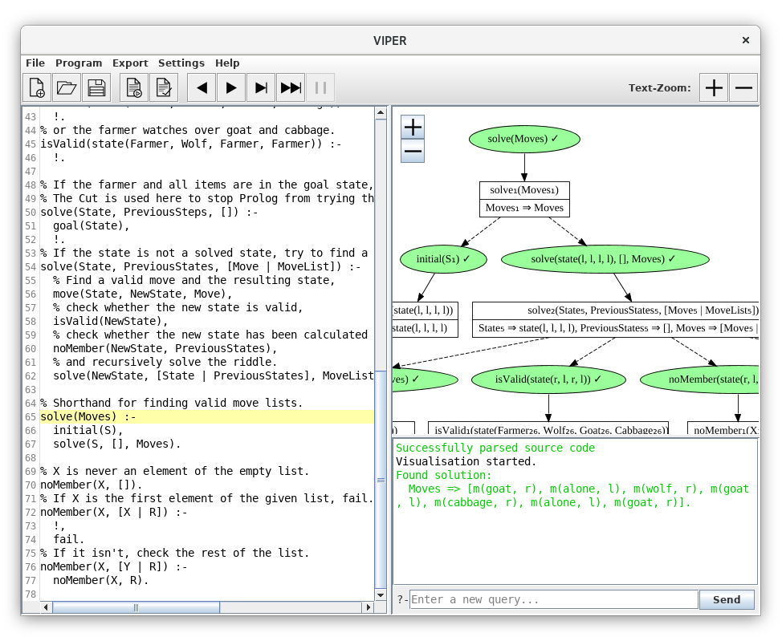

# VIPER

> Prolog interpreter and query visualizer

 

VIPER, short for **V**IPER **I**nteractive **P**rolog **E**ducation **R**untime, is a Java application that can run [Prolog](https://en.wikipedia.org/wiki/Prolog) programs and visualize the execution of queries.

This software was created as a project of the [Software Engineering Practice](https://pp.ipd.kit.edu/lehre/SS2018/pse/?lang=en) course at the [Karlsruhe Institute of Technology](https://www.kit.edu).

## Features

- Parser, formatter and interpreter for a subset of the Prolog language inlcuding cut, arithmetics and lists
- Jump back and forth between query execution steps and solutions
- Export of visualizations as `.png` and `.svg` images
- Sample programs
- Standard library including list operations and math functions (factorial, fibonacci, ...)
- Multiple languages

## Contributing

To contribute to the project, just open a pull request on GitHub. Please make sure to match our existing git conventions:

- Prefix your commit message with a short topic, e.g. "spec:"
- Use the **imperative** form ("Add", "Fix", ...) with the first word being **capitalized**
- The title does **not** end with a **dot**
- When updating your local branch to import changes made in master, use the pull **--rebase** option to prevent merge commits

Also, please run `./gradlew build` to make sure your code doesn't break any tests and is valid against our Checkstyle rules.

## License

VIPER is published under the [MIT license](../LICENSE).

The software makes use of:

- [Apache Batik](https://xmlgraphics.apache.org/batik/) (Apache License)
- [graphviz-java](https://github.com/nidi3/graphviz-java) (Apache License)
- [RSyntaxTextArea](https://github.com/bobbylight/RSyntaxTextArea) (modified BSD License)
- Liberation Serif (SIL Open Font License)
